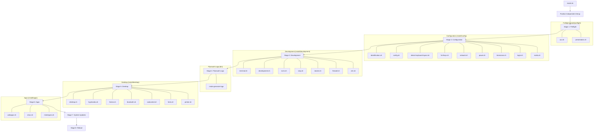

# NMDE: Not My Desktop Environment

NMDE is a comprehensive, automated system for setting up and managing a complete and personalized Arch Linux desktop environment. It's built around the Hyprland Wayland compositor and a curated set of modern, efficient tools. The goal of NMDE is to provide a beautiful, functional, and highly-automated development environment out of the box, while still allowing for deep personalization.


## Philosophy

- **Automation First:** From initial installation to ongoing configuration changes, NMDE strives to automate as much as possible, ensuring a consistent and reproducible environment.
- **Sensible Defaults:** NMDE comes with a set of carefully chosen defaults for applications, themes, and configurations, providing a great experience from the first boot.
- **Deep Personalization:** While highly automated, NMDE is not a black box. It's designed to be easily customized and extended. User configurations are kept separate from the core NMDE files, making updates seamless.
- **Modern & Efficient:** The environment is built with modern, fast, and keyboard-driven tools to maximize productivity.

## Features

- **Hyprland Desktop:** A fully configured desktop environment based on the Hyprland Wayland compositor, with Waybar, Hyprlock, and other essential components.
- **Complete Theming System:** Easily switch between multiple pre-configured themes that cover everything from your terminal and editor to your application launcher and system bars.
- **Automated Installation:** A single script to install and configure the entire system, including applications, development tools, and all dotfiles.
- **Python-based CLI:** A simple and extensible command-line interface for managing your environment.
- **Docker Compose Management:** A TUI for managing a collection of dockerized applications and services.
- **Migration System:** A robust migration system allows for smooth updates to your configuration over time without overwriting your personal changes.
- **Curated Application Suite:** Includes a selection of applications for development, productivity, and system management, such as Neovim (with a LazyVim starter config), Docker, Qutebrowser, and more.

## Installation

You can install NMDE with a single command. This will clone the repository and start the installation process.

```bash
wget -qO- https://raw.githubusercontent.com/magus-corp/nmde/main/boot.sh | bash
```

For a minimal installation that skips most applications, you can set the `nmde_BARE` environment variable:

```bash
wget -qO- https://raw.githubusercontent.com/magus-corp/nmde/main/boot.sh | nmde_BARE=true bash
```

The installation script will guide you through the process. After it's done, your system will reboot into your new NMDE environment.

## Usage

The `nmde` command is the main entry point for managing your environment.

### `nmde composes`

This command launches a Text-based User Interface (TUI) for managing your docker-compose stacks located in `~/.local/share/nmde/composes`.

- **[x] / [ ]**: Toggle services on or off.
- **Sync**: Applies the changes, starting toggled-on services and stopping toggled-off ones.
- **Quit**: Exits the application.

#### Adding Your Own Services

1.  Create a new `your-service.yaml` file in `~/.local/share/nmde/composes`.
2.  If your service requires environment variables, create a `your-service.env` file in `~/.local/share/nmde/composes/env_files`.
3.  The service will automatically appear in the `nmde composes` TUI.

### `nmde refresh`

This command refreshes various components of the NMDE environment.

-   `nmde refresh applications`: Refreshes application launchers and icons.
-   `nmde refresh config <config_file>`: Deploys a config file from the nmde defaults to your `~/.config` directory.
-   `nmde refresh hypridle`: Refreshes the hypridle configuration and restarts the service.
-   `nmde refresh hyprlock`: Refreshes the hyprlock configuration.
-   `nmde refresh plymouth`: Refreshes the plymouth theme.
-   `nmde refresh swayosd`: Refreshes the swayosd configuration and restarts the service.
-   `nmde refresh walker`: Refreshes the walker configuration and restarts the service.
-   `nmde refresh waybar`: Refreshes the waybar configuration and restarts the service.

### `nmde spellbook`

The spellbook is a collection of useful utility scripts.

-   `nmde spellbook mkv-to-mp4 <input_file.mkv>`: Converts a Matroska video file (MKV) to an MP4 container without re-encoding the video stream.

### Other Commands

-   `nmde generate-logo`: Generates the NMDE logo from a text file.
-   `nmde menu-power`: Displays the power menu.
-   `nmde restart-waybar`: Restarts the Waybar service.

## Customization

You are encouraged to customize your environment. Here are some key files and directories for personalization:

-   **Hyprland:** `~/.config/hypr/hyprland.conf` is the main entry point for your personal Hyprland configuration. You can add your own settings here, which will be loaded on top of the NMDE defaults.
-   **Shell:** `~/.zshrc` is your personal Zsh configuration file. You can add your own aliases, functions, and settings here.
-   **Themes:** To create your own theme, you can copy one of the existing themes in `~/.local/share/nmde/themes` and modify it.

## Updating

To update NMDE and your system, you can use the `nmde-update` command. This will pull the latest changes from the NMDE repository, run any pending migrations, and update your system packages.

## Contributing

Contributions are welcome! If you have any ideas, suggestions, or bug reports, please open an issue or submit a pull request on the [GitHub repository](https://github.com/magus-corp/nmde).

## License

This project is licensed under the MIT License. See the `LICENSE` file for details.

## Installation Flow

Here is a visual representation of the `install.sh` script's execution flow. The main script orchestrates a series of stages, with each stage sourcing scripts from specific directories to perform its tasks.



